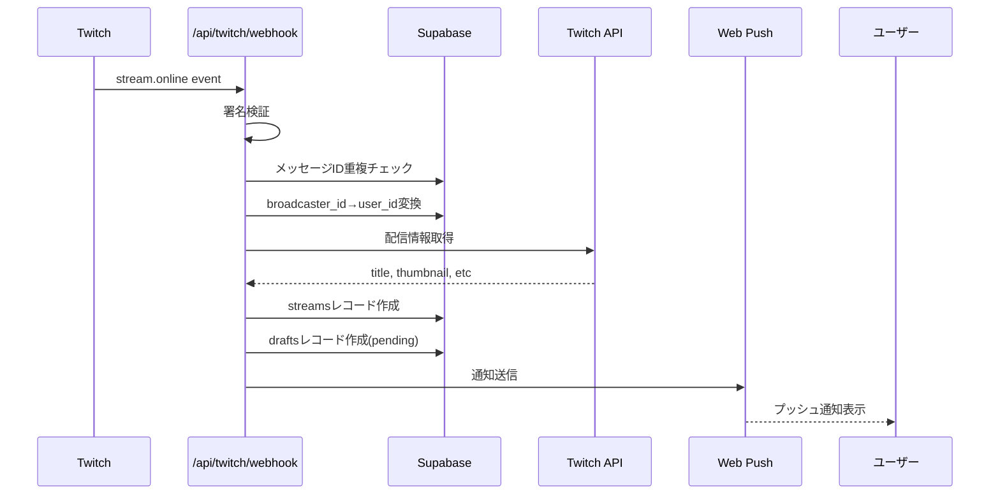
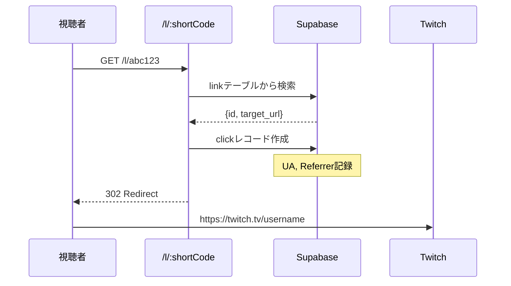
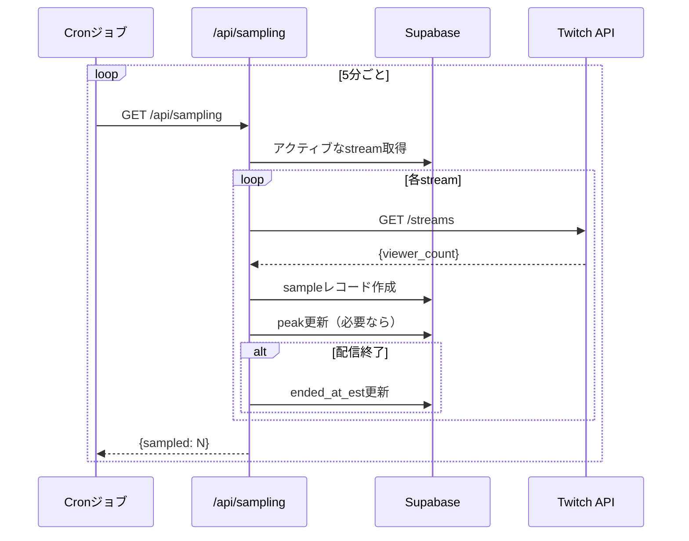
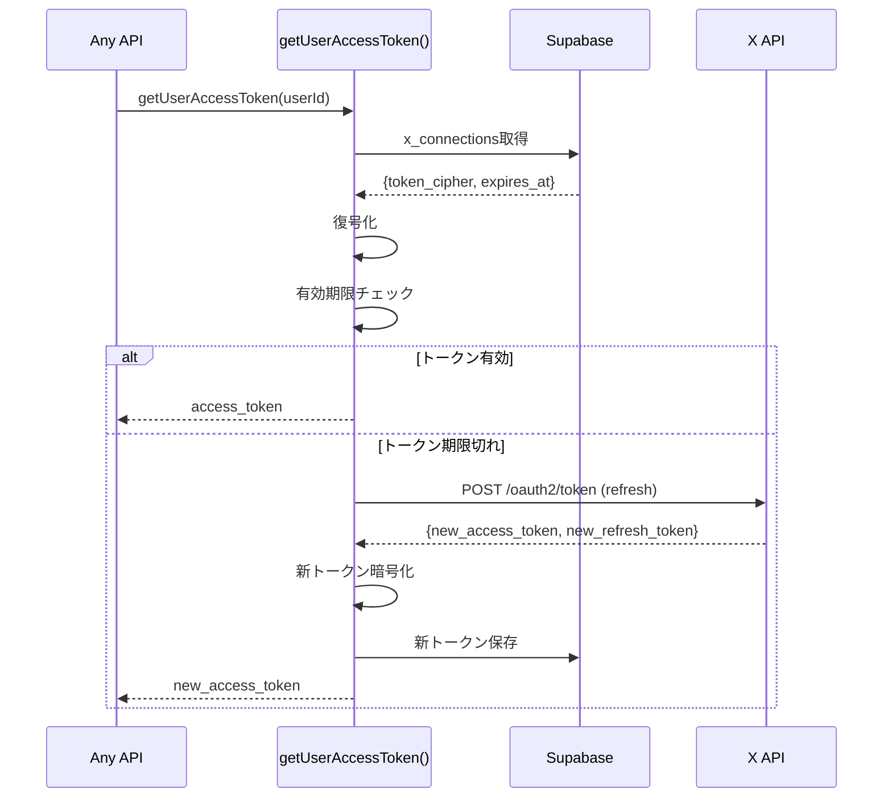

# データフロー図

CastCueの主要なデータフローを図解。

## 全体フロー概要

```
[Twitch配信開始]
     ↓
[Twitch EventSub] → webhook → [CastCue API]
     ↓
[Stream Record作成]
     ↓
[Draft作成（pending）]
     ↓
[Web Push通知送信] → [ユーザーのブラウザ/デバイス]
     ↓
[ユーザーが通知をクリック]
     ↓
  ┌─────────────────┐
  │ テンプレートで投稿 │ or │ 編集して投稿 │
  └─────────────────┘
     ↓                     ↓
[auto-post API]      [編集画面]
     ↓                     ↓
[短縮URL生成]          [手動投稿]
     ↓                     ↓
[X OAuth token取得]   （同じ処理）
     ↓
[X API: ツイート投稿]
     ↓
[Delivery Record作成]
     ↓
[Draft: posted]
     ↓
[サンプリング開始]
     ↓
[定期的な視聴者数取得]
     ↓
[リフト効果算出]
```

## 1. 配信開始〜通知送信

### フロー詳細


### データ構造

**Twitch Event:**
```json
{
  "event": {
    "id": "stream-123",
    "broadcaster_user_id": "12345",
    "broadcaster_user_login": "username",
    "started_at": "2025-01-01T12:00:00Z"
  }
}
```

**Stream Record:**
```json
{
  "id": 1,
  "user_id": "uuid",
  "platform": "twitch",
  "stream_id": "stream-123",
  "started_at": "2025-01-01T12:00:00Z",
  "ended_at_est": null,
  "peak": null
}
```

**Draft Record:**
```json
{
  "id": "draft-uuid",
  "user_id": "uuid",
  "stream_id": 1,
  "title": "配信タイトル",
  "twitch_url": "https://twitch.tv/username",
  "image_url": "https://...",
  "status": "pending"
}
```

**Push Notification Payload:**
```json
{
  "title": "配信開始",
  "body": "配信タイトル\n\nテンプレートで即投稿、または編集してから投稿できます",
  "tag": "castcue-draft-{draft_id}",
  "draftId": "draft-uuid",
  "url": "/approve/{draft_id}",
  "actions": [
    {"action": "template", "title": "テンプレートで投稿"},
    {"action": "edit", "title": "編集して投稿"}
  ]
}
```

## 2. 自動投稿フロー

### フロー詳細
```mermaid
sequenceDiagram
    participant SW as Service Worker
    participant AutoPost as /api/drafts/auto-post
    participant DB as Supabase
    participant Link as Short Link
    participant X as X API
    participant Sampling as Sampling

    SW->>AutoPost: POST {draft_id}
    AutoPost->>DB: draft取得(status=pending)
    AutoPost->>DB: テンプレート取得(variant=A)
    AutoPost->>AutoPost: 変数置換{title},{twitch_url}
    AutoPost->>Link: 短縮URL生成
    Link-->>AutoPost: shortUrl, linkId
    AutoPost->>AutoPost: URLを短縮URLに置換
    AutoPost->>DB: X token取得(暗号化)
    AutoPost->>AutoPost: token復号化
    AutoPost->>AutoPost: 有効期限チェック
    alt トークン期限切れ
        AutoPost->>X: refresh token使用
        X-->>AutoPost: 新しいトークン
        AutoPost->>DB: 新トークン保存(暗号化)
    end
    AutoPost->>X: POST /2/tweets
    X-->>AutoPost: {id, text}
    AutoPost->>DB: deliveryレコード作成
    AutoPost->>DB: draft.status = posted
    AutoPost->>Sampling: startSampling(stream_id)
    Sampling->>DB: サンプル作成
    AutoPost-->>SW: {success, post_id, link_id}
    SW->>SW: 成功通知表示
```

### データ変換

**テンプレート:**
```
【配信開始】{title} をプレイ中！
{twitch_url}

#Twitch #配信中
```

**変数置換後:**
```
【配信開始】Apex Legends をプレイ中！
https://twitch.tv/username

#Twitch #配信中
```

**短縮URL置換後:**
```
【配信開始】Apex Legends をプレイ中！
https://castcue.com/l/abc123

#Twitch #配信中
```

**Delivery Record:**
```json
{
  "id": "delivery-uuid",
  "user_id": "uuid",
  "stream_id": 1,
  "channel": "x",
  "status": "sent",
  "idempotency_key": "random-hex",
  "post_id": "1234567890",
  "latency_ms": 1250
}
```

## 3. 短縮URL・クリック追跡

### フロー詳細


**Link Record:**
```json
{
  "id": "link-uuid",
  "user_id": "uuid",
  "short_code": "abc123",
  "target_url": "https://twitch.tv/username",
  "campaign_id": "stream-1"
}
```

**Click Record:**
```json
{
  "id": 1,
  "link_id": "link-uuid",
  "at": "2025-01-01T12:05:00Z",
  "ua": "Mozilla/5.0...",
  "referrer": "https://twitter.com"
}
```

## 4. サンプリング・リフト算出

### フロー詳細


**Sample Record:**
```json
{
  "id": 1,
  "stream_id": 1,
  "taken_at": "2025-01-01T12:10:00Z",
  "viewer_count": 150
}
```

**リフト計算:**
```javascript
// 投稿前の平均視聴者数（ベースライン）
baseline = average(samples before post_time) // 例: 100人

// 投稿後の平均視聴者数
afterPost = average(samples after post_time) // 例: 180人

// リフト効果
lift = afterPost - baseline // 80人
liftPercent = (lift / baseline) * 100 // 80%
```

## 5. OAuth Token管理

### Token Refresh フロー


**暗号化・復号化:**
```javascript
// 暗号化 (AES-256-GCM)
const iv = randomBytes(16);
const cipher = createCipheriv('aes-256-gcm', key, iv);
const encrypted = cipher.update(token, 'utf8', 'hex') + cipher.final('hex');
const tag = cipher.getAuthTag();
const result = `${iv.toString('hex')}:${tag.toString('hex')}:${encrypted}`;

// 復号化
const [ivHex, tagHex, encryptedHex] = result.split(':');
const decipher = createDecipheriv('aes-256-gcm', key, Buffer.from(ivHex, 'hex'));
decipher.setAuthTag(Buffer.from(tagHex, 'hex'));
const token = decipher.update(encryptedHex, 'hex', 'utf8') + decipher.final('utf8');
```

## データ保持期間

| データ | 保持期間 | 理由 |
|-------|---------|------|
| streams | 無期限 | 分析用 |
| samples | 無期限 | リフト計算用 |
| drafts | 30日 | 古い下書きは自動削除推奨 |
| deliveries | 無期限 | 配信履歴 |
| links | 無期限 | クリック追跡 |
| clicks | 無期限 | 分析用 |
| x_connections | ユーザー削除まで | 認証情報 |
| push_subscriptions | ユーザー削除まで | 通知設定 |

## セキュリティ考慮事項

### 暗号化が必要なデータ
- ✅ X OAuth access_token
- ✅ X OAuth refresh_token
- ✅ Twitch OAuth token（将来的に）

### 署名検証が必要なエンドポイント
- ✅ `/api/twitch/webhook` (HMAC-SHA256)

### 認証が必要なエンドポイント
- ✅ `/api/x/oauth/start` (Supabase Session)
- ✅ `/api/push/register` (user_id検証)

---

次のステップ: [トラブルシューティング](../development/troubleshooting.md)で問題解決方法を確認
